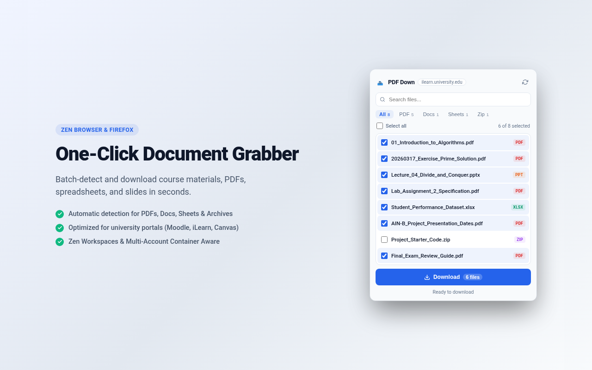

# PDF Down

A simple browser extension to batch-detect and download files (PDFs, docs, spreadsheets, slides, and archives) from the current page.

Works on Firefox, Zen Browser, and Chrome (MV3).



## Install from Store

- **Firefox Add-ons (AMO):** https://addons.mozilla.org/en-US/firefox/addon/pdf-down/

## Features

- **Batch download:** Select all or pick individual files to download at once.
- **LMS friendly:** Specially handled for university portals like Moodle, iLearn, and Canvas.
- **Container & Zen Workspace support:** Keeps your active tab's session cookies so you don't get logged out during downloads.
- **Background queue:** Downloads continue even if you close the popup.
- **Search & filter:** Quick search by filename, or filter by PDF, Docs, Sheets, or Zip.
- **Automatic theme:** Adapts to your browser's light or dark mode.

## Install Locally (Development)

### Firefox / Zen Browser
1. Open `about:debugging#/runtime/this-firefox`.
2. Click **Load Temporary Add-on**.
3. Select `manifest.json` in this folder.

### Chrome / Brave / Edge
1. Open `chrome://extensions`.
2. Enable **Developer mode** (top right).
3. Click **Load unpacked** and select this folder.

## Build Package

```bash
zip -r pdf-down.zip manifest.json popup.html popup.js content.js background.js icons README.md CHANGELOG.md
```

## Legal

Only download files you are authorized to access and store.
